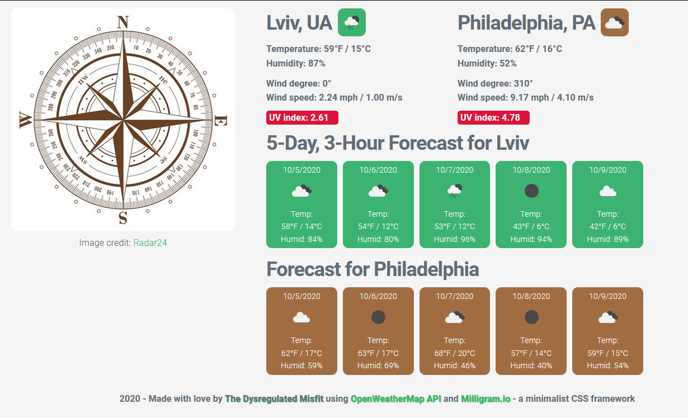

# Weather Dashboard

A searchable application with accessible session search history providing current weather and 5-day, 3-hour forecast for cities across the globe, utilizing the HTTP request capability via AJAX, obtainining and parsing JSON weather data from the third-party [OpenWeatherMap API](https://openweathermap.org/).

CSS styling done utilizing [Milligram.io](https://milligram.io) minimalist CSS framework. 

## Details

The application displays the current weather and forecast information for two cities when loaded - Lviv, Ukraine, and Philadelphia, PA, USA - two cities biographically important to the author of the app. The local information (Philadelphia) persists, while the information about Lviv is dynamically replaced by successive searches. 

A wind rose is displayed (with credit to [Radar24](https://radar24.pl/en/wind-direction/)), both for esthetic pleasure and to help orient the user as to the meaning of the wind degree data. 

Search history is accessible via clickable buttons in the header, which can help reload the information without retyping the city name. The information is not allowed to persist beyond the current session and clears when the page is reloaded.

# Link to the finished app

[Weather Dashboard](https://bohdicave.github.io/Weather-Dashboard)

You are welcome to submit any suggestions on improving the functionality or the esthetics of the app, if you feel sufficiently motivated to do so. [Contact information](https://bohdicave.github.io/contact.html)

# Screenshots

