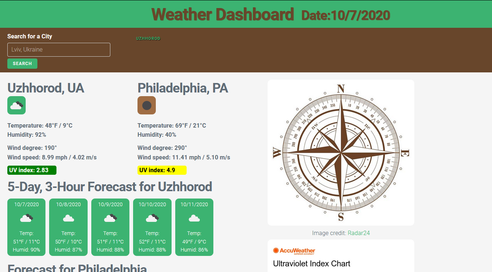

# Weather Dashboard

A searchable application with accessible session search history providing current weather and 5-day, 3-hour forecast for cities across the globe, utilizing the HTTP request capability via AJAX, obtainining and parsing JSON weather data from the third-party [OpenWeatherMap API](https://openweathermap.org/).

CSS styling done utilizing [Milligram.io](https://milligram.io) minimalist CSS framework. 

## Details

The application displays the current weather and forecast information for two cities when loaded - Lviv, Ukraine, and Philadelphia, PA, USA - two cities biographically important to the author of the app. The local information (Philadelphia) persists, while the information about Lviv is dynamically replaced by successive searches. 

A wind rose is displayed both for esthetic pleasure and to help orient the user as to the meaning of the wind degree data. Additional reference charts for interpreting the UV index  and the humidity-based heat index are also included are also included. 

Search history is accessible via clickable buttons in the header, which can help reload the information without retyping the city name. The information is not allowed to persist beyond the current session and clears when the page is reloaded.

## Credits

As with all the projects featured to date, many thanks to the wonderful educational team of instructors and support staff from University of Pennsylvania's Coding Bootcamp Program, administered in coooperation with Trilogy Educational Services. 

Additional thanks to:
* [OpenWeatherMap API](https://openweathermap.org/) - for providing access to real-time weather data.
* [Milligram.io](https://milligram.io) - for a beautiful minimalist CSS framework.
* [Radar24](https://radar24.pl/en/wind-direction/) for the wind rose. 
* [AccuWeather](https://www.accuweather.com/en/weather-news/how-to-use-the-uv-index-to-protect-yourself-from-the-suns-harmful-rays-2/432603) for the UV index chart
* [Calculator.net](https://www.calculator.net/heat-index-calculator.html) for the Farenheit-based heat index chart
* [Srjskam](http://srjskam.blogspot.com/2017/03/heat-index-in-celsius.html) for the Celsius-based heat index chart

# Link to the finished app

[Weather Dashboard](https://bohdicave.github.io/Weather-Dashboard)

You are welcome to submit any suggestions on improving the functionality or the esthetics of the app, if you feel sufficiently motivated to do so. [Contact information](https://bohdicave.github.io/contact.html)

# Screenshots

## Mobile version with history search buttons displayed
